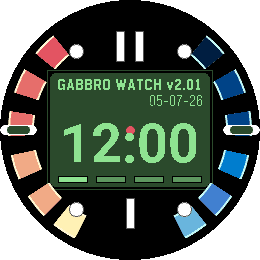
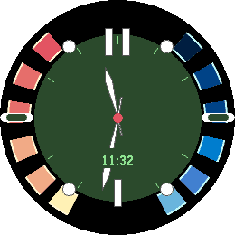
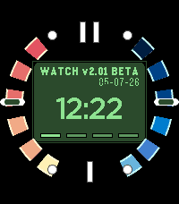
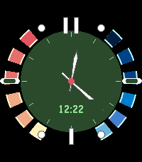

GabbroEye HUD
=============

GabbroEye HUD is a Pebble watchface branch that recreates the feel of the
Nintendo 64-era spy watch interface for modern PebbleOS hardware, with the
layout tuned for the 260x260 Gabbro display and validated on the 200x228 Emery
display.

The face is drawn from Pebble primitives rather than a scaled bitmap.  The
segmented warm/cool outer ring, dark green central display, reticle, battery
meter, and Bluetooth meter are all calculated from the current screen bounds so
the rendering stays sharp on Gabbro and Emery, and still degrades sensibly on
older targets.

Features
--------

- Gabbro-native 260x260 round layout with Emery-compatible scaling
- Warm and cool segmented status bars inspired by the classic spy watch concept
- Green HUD display with current time, date, battery percentage, and link state
- Open lower ring so the warm and cool segments stay on the sides of the face
- Larger bundled-font digital time rendering on Gabbro
- Configurable HUD date format and analogue seconds behaviour
- Full-face analogue dial mode
- Second-level refresh for the live watch display
- Analogue seconds are shown only while the backlight is on
- Quiet mode moon indicator
- Wrist-tap toggle between digital and analogue HUD modes
- Geometry tests covering Gabbro, Emery, and classic rectangular screens

Preview
-------

| Platform | Digital | Analogue |
| --- | --- | --- |
| Gabbro |  |  |
| Emery |  |  |

Implementation Notes
--------------------

The HUD lives in `src/spy_face.c` and `src/spy_face_geometry.c`.  Geometry is
kept separate from Pebble drawing so the scale calculations can be tested with a
normal host C compiler.

The original fuzzy text implementation is still present underneath the top HUD
layer in this branch.  That keeps the existing project build structure intact
while the new face is iterated on.

The GabbroEye HUD exposes a small configuration page for the date format and
analogue seconds behaviour.  The JavaScript companion sends only the HUD keys;
legacy Fuzzy Text alignment, font, and colour options are intentionally not
exposed.

Checks
------

Run the usual project checks with:

```sh
make lint
make misc_checks
```

`make lint` performs the Pebble build.  `make misc_checks` runs the host-side C
tests, including the HUD geometry checks.

Acknowledgements
----------------

This branch is an original Pebble implementation inspired by the broad visual
concept of a classic console spy-watch interface.  It does not include Nintendo,
Rare, or GoldenEye assets.

The repository was originally based on the Fuzzy Text Two watchface work carried
forward by gloriousCode from earlier open source Pebble text-watch projects.
