Fuzzy Text Two
==============

Fuzzy Text Two is a modernised Pebble watchface built from the classic
fuzzy text lineage.  The goal of this project is to keep the simple,
word-based feel of the original Text Watch style while updating it for
newer PebbleOS targets, especially Emery and Gabbro.

The original watchface was designed around older 144x168 screens.  This
version adds sharper high-resolution text, larger bundled fonts for
modern displays, row/date colour customisation, and layout checks that keep the
words inside the screen even when languages, font choices, or round
displays make the text harder to fit.

This project is originally based on the [PebbleTextWatch][] by Mihai
Dumitrache, which reproduced the look of the Text Watch that comes
standard with the [Pebble][].

[Pebble]: https://getpebble.com/
[PebbleTextWatch]: https://github.com/wearewip/PebbleTextWatch

Mattias Bäcklund created a modified version, [Swedish fuzzy text
watch][], that displays fuzzy time.  Mattias wanted to combine the
elegant layout and animations of the Text Watch with the natural
language of the Fuzzy Time watchface, and wanted it in his native
language, Swedish.

[Swedish fuzzy text watch]: https://github.com/Sarastro72/Swedish-Fuzzy-Text-watch

This version builds upon the work by Mihai and Mattias by carrying the
old watchface forward for current Rebble/PebbleOS development.

Features:

 - Fuzzy time in natural language
 - Modern PebbleOS target support, including Emery and Gabbro
 - Sharper high-resolution word rendering with bundled Roboto fonts
 - Larger text on newer screens without relying on bitmap scaling
 - Fit-safe line breaking across one to four lines of text
 - Automatic fallback to smaller font tiers when a line would overflow
 - Foreground and background colour customisation
 - Optional separate colours for minute row one, minute row two, hour row, and corner date sections
 - Font presets and visual style presets
 - Optional small corner date with compact numeric and abbreviated formats
 - Nice staggered animation
 - Multiple languages inherited from the original international face

Screenshots
-----------

These screenshots show the modernised rendering across the supported
PebbleOS platforms, including colour presets, text alignment, and the
higher-resolution Emery and Gabbro layouts.

| Platform | Default, 7:25 | Black/red, 12:00 | Ocean left, 3:15 | White/blue right, 11:45 |
| --- | --- | --- | --- | --- |
| Aplite |  |  |  | 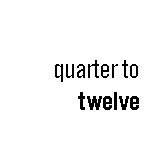 |
| Basalt | 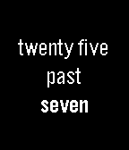 |  |  | 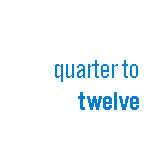 |
| Chalk | 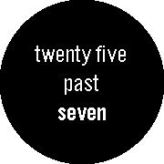 | 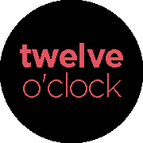 |  | 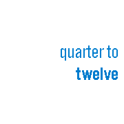 |
| Diorite |  |  | 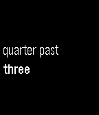 |  |
| Emery | 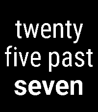 | 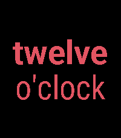 | 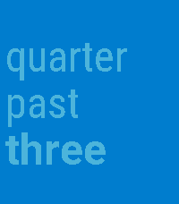 | 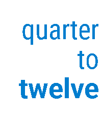 |
| Gabbro | 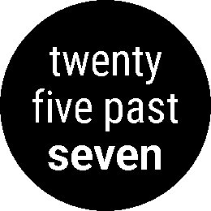 | 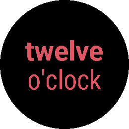 | 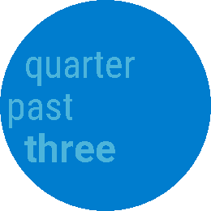 | 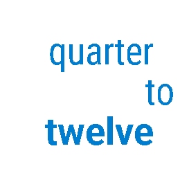 |

On monochrome platforms such as Aplite and Diorite, colour presets are
mapped to high-contrast black and white so text remains readable.

The following options can be configured, using the Pebble app on your
phone:

- Font preset
- Visual preset, including colour and corner date showcase presets
- Foreground and background colours
- Minute row one, minute row two, hour row, and date section text colours
- Text alignment (centered, left, or right)
- Optional corner date, shown at the top or bottom with up to three coloured sections
- Corner date format (`dd-mm-yy`, `mm-dd-yyyy`, `Mon 3 Aug`, `dd/mm`, or `mm/dd`)
- Language

At this time the included languages are:

- Catalan
- English
- French
- German
- Norwegian
- Spanish
- Swedish

Authorship
----------

Fuzzy Text Two is maintained by [gloriousCode][gloriousCode].  This
modernised version updates the old watchface for current PebbleOS
targets, adds colour customisation, and improves text resolution on
newer screens.

[gloriousCode]: https://github.com/gloriousCode

Acknowledgements
----------------

Thanks to the people whose earlier work made this watchface possible:

- [Mihai Dumitrache][Mihai], implemented an open source version of Text Watch
- [Mattias Bäcklund][Mattias], created Swedish fuzzy text watch
- [Jesse Hallett][Jesse], added earlier configuration options and multiple language support
- [Filip Horvei][iFlips], provided Norwegian translation
- Tomi De Lucca, discovered fix for a severe iOS bug & assisted with Spanish translation

[Mihai]: https://github.com/mmdumi
[Mattias]: https://github.com/Sarastro72
[Jesse]: https://github.com/hallettj
[iFlips]: https://github.com/iFlips

Contributing
------------

If you would like to request a translation, provide a translation, or
point out errors in a translation, please [open an issue][issue].

[issue]: https://github.com/gloriousCode/fuzzy-text-two/issues/new

For an example of what is needed for translations, take a look at
[`strings-en.c`][en].  In case you want to implement a translation
yourself, look at [818e076][es] to see all of the code changes that are
necessary to do so.

[en]: https://github.com/gloriousCode/fuzzy-text-two/blob/master/src/strings-en_GB.c
[es]: https://github.com/gloriousCode/fuzzy-text-two/commit/818e07686761adc00245986f6d389076534a5c1a

Please feel free to open issues for matters other than translations!
Pull requests are welcome as well.
